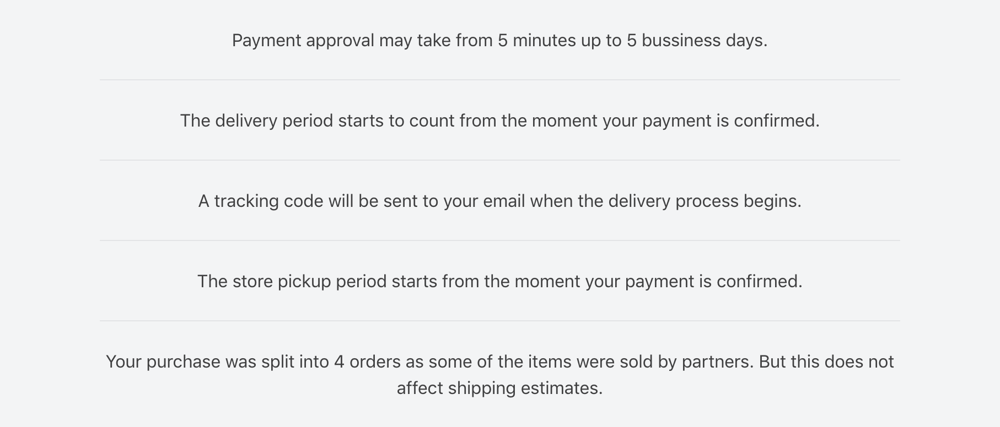
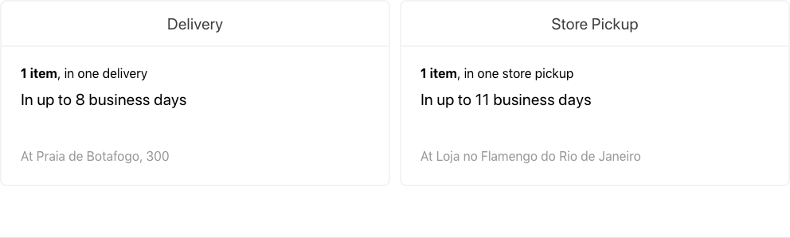
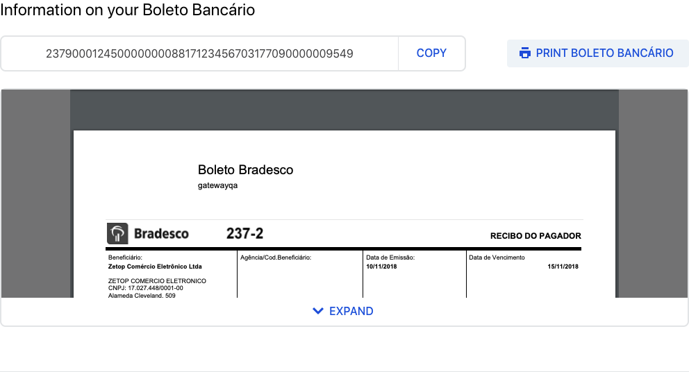
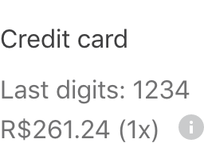
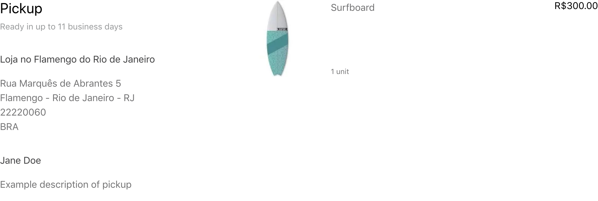
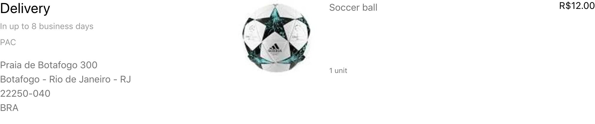
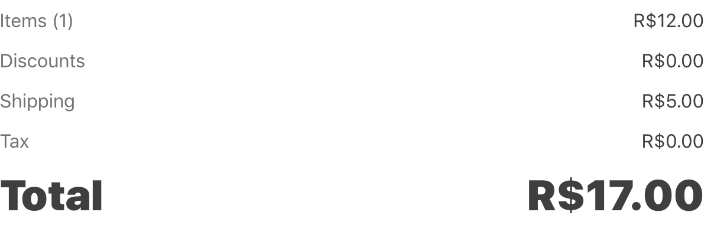

📢 Use this project, [contribute](https://github.com/vtex-apps/order-placed) to it or open issues to help evolve it using [Store Discussion](https://github.com/vtex-apps/store-discussion).

# Order Placed

## Configuration

1. Import the modal layout's app to your theme's dependencies in the `manifest.json`, for example:

```jsonc
{
  "vtex.order-placed": "1.x"
}
```

2. Now you can build your own order placed page with the blocks exported by the app. First, you have to define a `order-placed` block, i.e inside your `store/blocks` directory:

_Note: this is the default `order-placed` layout implementation._

```jsonc
// store/blocks/order-placed.jsonc
{
  "order-placed": {
    "blocks": ["op-header", "op-order"]
  },
  "op-header": {
    "children": [
      "op-section#confirmation",
      "op-section#notices",
      "op-summary-section",
      "op-bank-invoice-section"
    ]
  },
  "op-section#confirmation": {
    "props": {
      "name": "confirmation",
      "marginBottom": 9,
      "borderless": true
    },
    "children": [
      "op-confirmation-icon",
      "op-confirmation-title",
      "op-confirmation-message",
      "flex-layout.row#confirmation-buttons"
    ]
  },
  "flex-layout.row#confirmation-buttons": {
    "props": {
      "blockClass": "confirmationButtons",
      "marginTop": 8,
      "marginBottom": 8,
      "horizontalAlign": "center",
      "preventHorizontalStretch": true
    },
    "children": ["flex-layout.col#confirmation-buttons"]
  },
  "flex-layout.col#confirmation-buttons": {
    "children": ["op-print-button"]
  },
  "op-section#notices": {
    "props": {
      "name": "notices",
      "marginBottom": 9,
      "borderless": true
    },
    "children": ["op-notices"]
  },
  // each order section
  "op-order": {
    "children": [
      "flex-layout.row#order-header",
      "op-order-split-notice",
      "op-order-customer",
      "op-section#payments",
      "op-section#pickup-items",
      "op-section#delivery-items",
      "op-order-takeaway-items",
      "op-order-total"
    ]
  },
  // each order header
  "flex-layout.row#order-header": {
    "props": {
      "fullWidth": true,
      "colSizing": "auto",
      "colGap": 5,
      "marginBottom": 5
    },
    "children": [
      "flex-layout.col#order-header-info",
      "flex-layout.col#order-header-options"
    ]
  },
  "flex-layout.col#order-header-info": {
    "children": ["op-order-number", "op-order-datetime", "op-order-seller"]
  },
  "flex-layout.col#order-header-options": {
    "children": ["responsive-layout.desktop#order-options-desktop"]
  },
  "responsive-layout.desktop#order-options-desktop": {
    "children": ["op-order-options"]
  },
  // payment section
  "op-section#payments": {
    "props": {
      "name": "paymentMethods"
    },
    "children": [
      "op-order-payment",
      "responsive-layout.mobile#order-options-mobile"
    ]
  },
  // bottom of top section of order header
  "responsive-layout.mobile#order-options-mobile": {
    "children": ["op-order-options#mobile"]
  },
  "op-order-options#mobile": {
    "props": {
      "blockClass": "mobile",
      "fullWidth": true
    }
  },
  "op-section#pickup-items": {
    "props": {
      "name": "pickupPackages"
    },
    "children": ["op-order-pickup-packages"]
  },
  "op-section#delivery-items": {
    "props": {
      "name": "deliveryPackages"
    },
    "children": ["op-order-delivery-packages"]
  }
}
```

### Blocks

#### `order-placed`

Main block, responsible for rendering the whole order placed page. It accepts the following blocks:

- `op-header`
- `op-order-list`
- `order-placed-top`
- `promotion-banner`

_Note: `order-placed-top`,`promotion-banner` are deprecated. You can replace them with common blocks in your `blocks.json`._

---

#### `op-section`

Splits your page into separate and semantic sections.

**Composition:**

Accepts an array of any kind of children blocks.

**Props:**

| Prop name       | Type                                       | Description                                                    | Default value |
| --------------- | ------------------------------------------ | -------------------------------------------------------------- | ------------- |
| `borderless`    | `MaybeResponsiveInput<boolean> \| boolean` | Remove the bottom border of the section                        | `false`       |
| `marginBottom`  | `MaybeResponsiveInput<number> \| number`   | Margin space below the section                                 | `0`           |
| `paddingBottom` | `MaybeResponsiveInput<number> \| number`   | Padding space below the section                                | `0`           |
| `width`         | `MaybeResponsiveInput<string> \| string`   | Width of the section                                           | `100%`        |
| `name`          | `string`                                   | Name of the section. Use it to have custom css handles for it. | `undefined`   |

**CSS Handles:**

| CSS Handles       | Description          |
| ----------------- | -------------------- |
| `section`         | All section blocks   |
| `section--{name}` | Section named `name` |

---

#### `op-header`

Defines the header content of the page.

**Composition:** accepts an array of any kind of children blocks.

**Props:** none.

**CSS Handles:**

| CSS Handles         | Description     |
| ------------------- | --------------- |
| `orderPlacedHeader` | The page header |

---

#### `op-confirmation-icon`

Renders the confirmation icon.

**Composition:** none.

**Props:** none.

**CSS Handles:**

| CSS Handle                | Description  |
| ------------------------- | ------------ |
| `confirmationIconWrapper` | Icon wrapper |

| Default appearance                                         |
| ---------------------------------------------------------- |
|  |

---

#### `op-confirmation-title`

Renders the confirmation title.

**Composition:** none.

**Props:** none.

**CSS Handles:**

| CSS Handle          | Description                     |
| ------------------- | ------------------------------- |
| `confirmationTitle` | Confirmation title `h4` element |

| Default appearance                                           |
| ------------------------------------------------------------ |
|  |

---

#### `op-confirmation-message`

Renders the confirmation message, containing the clients email.

**Composition:** none.

**Props:** none.

**CSS Handles:**

| CSS Handle            | Description                      |
| --------------------- | -------------------------------- |
| `confirmationMessage` | Confirmation message `p` element |

| Default appearance                                               |
| ---------------------------------------------------------------- |
|  |

---

#### `op-print-button`

Renders a button that triggers a full page print.

**Composition:** none.

**Props:** none.

**CSS Handles:**: none.

| Default appearance                 |
| ---------------------------------- |
|  |

---

#### `op-notices`

Renders a list of important informations relevant to the currently placed order. The messages may vary according to the type of order.

**Composition:** none.

**Props:** none.

**CSS Handles:**

| CSS Handle       | Description                 |
| ---------------- | --------------------------- |
| `noticesList`    | List `ul` element           |
| `noticeListItem` | Each list `li` item element |

| Default appearance                     |
| -------------------------------------- |
|  |

---

#### `op-summary-section`

If a placed order is split between delivery and pickup, renders a summary of all pickup and delivery packages with informations such as number of items, packages, pickup/delivery address and pickup/delivery SLA.

**Composition:** none.

**Props:** none.

**CSS Handles:**

| CSS Handle             | Description                                 |
| ---------------------- | ------------------------------------------- |
| `section--summary`     | Summary whole section                       |
| `summaryRow`           | Row wrapper of both summary boxes           |
| `summaryRow`           | Row wrapper of both summary boxes           |
| `summaryCol`           | Column wrapper of each summary box          |
| `summaryAddress`       | Wrapper of the pickup address               |
| `summaryBox`           | Surrounding box of the summary              |
| `summaryBox--delivery` | Surrounding box of the delivery summary     |
| `summaryBox--pickup`   | Surrounding box of the pickup summary       |
| `summaryContent`       | Wrapper of the whole content of the box     |
| `summaryItems`         | Wrapper of the number of items and packages |
| `summaryShippingSLA`   | Wrapper of the shipping SLA information     |
| `summaryTitle`         | Box `h5` title element                      |

| Default appearance                                     |
| ------------------------------------------------------ |
|  |

---

#### `op-bank-invoice-section`

Renders the bank invoice section if payment method chosen was bank invoice.

**Composition:** none.

**Props:** none.

**CSS Handles:**

| CSS Handle                   | Description                                   |
| ---------------------------- | --------------------------------------------- |
| `section--bankInvoice`       | Bank invoice whole section                    |
| `barCodeWrapper`             | Wrapper of the barcode number and copy button |
| `barCodeNumber`              | Barcode number element                        |
| `barCodeCopyButtonWrapper`   | Wrapper of the copy button                    |
| `bankInvoiceEmbedWrapper`    | Wrapper of the bank invoice iframe            |
| `bankInvoiceEmbedBackground` | Background of the bank invoice iframe         |
| `bankInvoiceEmbed`           | Embed of the bank invoice PDF                 |

| Default appearance                                               |
| ---------------------------------------------------------------- |
|  |

---

#### `op-order`

Defines an order context to be able to render its meta information and packages. Must be used to display order data.

**Composition:** accepts an array of any kind of children blocks.

**Props:** none.

**CSS Handles:**

| CSS Handle     | Description                                       |
| -------------- | ------------------------------------------------- |
| `orderWrapper` | Wrapper of an order meta information and packages |

---

#### `op-order-number`

Renders the order id number. Must be placed inside an `op-order` block.

**Composition:** none.

**Props:** none.

**CSS Handles:**

| CSS Handle    | Description               |
| ------------- | ------------------------- |
| `orderNumber` | Order number `h3` element |

| Default appearance                               |
| ------------------------------------------------ |
|  |

---

#### `op-order-datetime`

Renders the date and time an order was placed. Must be placed inside an `op-order` block.

**Composition:** none.

**Props:** none.

**CSS Handles:**

| CSS Handle      | Description                         |
| --------------- | ----------------------------------- |
| `orderDatetime` | Order date and time `small` element |

| Default appearance                                   |
| ---------------------------------------------------- |
|  |

---

#### `op-order-seller`

Renders the seller of an order. Must be placed inside an `op-order` block.

**Composition:** none.

**Props:** none.

**CSS Handles:**

| CSS Handle    | Description                   |
| ------------- | ----------------------------- |
| `orderSoldBy` | Seller phrase `small` element |
| `orderSeller` | Seller name `span` element    |

| Default appearance                               |
| ------------------------------------------------ |
|  |

---

#### `op-order-split-notice`

Renders a message with the number of packages of an order if the order was split in more than one package. Must be placed inside an `op-order` block.

**Composition:** none.

**Props:** none.

**CSS Handles:**

| CSS Handle    | Description                    |
| ------------- | ------------------------------ |
| `splitNotice` | Wrapper of the message element |

| Default appearance                                           |
| ------------------------------------------------------------ |
|  |

---

#### `op-order-customer`

Renders the customer information. Must be placed inside an `op-order` block.

**Composition:** none.

**Props:** none.

**CSS Handles:** none.

| Default appearance                                   |
| ---------------------------------------------------- |
|  |

---

#### `op-order-options`

Renders the customer information. Must be placed inside an `op-order` block.

**Composition:** none.

**Props:**

| Prop name   | Type      | Description                                         | Default value |
| ----------- | --------- | --------------------------------------------------- | ------------- |
| `fullWidth` | `boolean` | Make the options wrapper take full horizontal space | `false`       |

**CSS Handles:**

| CSS Handles           | Description                   |
| --------------------- | ----------------------------- |
| `orderOptionsWrapper` | Wrapper of the option buttons |

| Default appearance                                           |
| ------------------------------------------------------------ |
|  |

---

#### `op-order-payment`

Renders the customer information. Must be placed inside an `op-order` block.

**Composition:** none.

**CSS Handles:**

| CSS Handles           | Description                         |
| --------------------- | ----------------------------------- |
| `orderPaymentWrapper` | Wrapper of the payment methods list |
| `orderPaymentItem`    | Wrapper of each payment method item |

| Default appearance                                 |
| -------------------------------------------------- |
|  |

---

#### `op-order-pickup-packages`

Renders an order pickup packages information and product list. Must be placed inside an `op-order` block.

**Composition:** none.

**CSS Handles:**

| CSS Handles               | Description                                         |
| ------------------------- | --------------------------------------------------- |
| `package`                 | All package sections                                |
| `package--delivery`       | The delivery package section                        |
| `packageHeaderColumn`     | Column of header of a package section               |
| `packageHeader`           | Header of a package section                         |
| `packageHeader--delivery` | Header of the delivery package section              |
| `packageShippingEstimate` | Delivery estimate `small` element                   |
| `packageInfoWrapper`      | Wrapper of a package's information                  |
| `packageAddressWrapper`   | Wrapper of the package shipping address             |
| `packageReceiver`         | Name of the package's receiver                      |
| `packageAdditionalInfo`   | Wrapper of additional information about the package |
| `productList`             | Product list `ul` element                           |
| `productListItem`         | Product list `li` item element                      |
| `productWrapper`          | Wrapper of a single product                         |
| `productImageColumn`      | Column of a product's image                         |
| `productImageWrapper`     | Wrapper of a product's image                        |
| `productInfoColumn`       | Column of a product's information                   |
| `productName`             | Product's `a` element                               |
| `productMeasurementUnit`  | Product's measurement unit `small` element          |
| `productQuantity`         | Product's quantity `small` element                  |
| `productPrice`            | Product's price                                     |
| `attachmentWrapper`       | Wrapper for a product's attachment                  |
| `attachmentHeader`        | Header of an attachment                             |
| `attachmentTitle`         | Title of a attachment                               |
| `attachmentToggleWrapper` | Wrapper of the toggle button of an attachment       |
| `attachmentToggleButton`  | Button for toggling the attachment's accordion      |
| `attachmentToggleLabel`   | Attachment's toggle label                           |
| `attachmentContent`       | Attachment's content wrapper                        |
| `attachmentContentItem`   | Each attachment's content paragraph                 |

| Default appearance                                                 |
| ------------------------------------------------------------------ |
|  |

---

#### `op-order-delivery-packages`

Renders an order delivery packages information and product list. Must be placed inside an `op-order` block.

**Composition:** none.

**CSS Handles:**

| CSS Handles               | Description                                    |
| ------------------------- | ---------------------------------------------- |
| `package`                 | All package sections                           |
| `package--delivery`       | The delivery package section                   |
| `packageHeaderColumn`     | Column of header of a package section          |
| `packageHeader`           | Header of a package section                    |
| `packageHeader--delivery` | Header of the delivery package section         |
| `packageShippingEstimate` | Delivery estimate `small` element              |
| `packageAddressWrapper`   | Wrapper of the package shipping address        |
| `productList`             | Product list `ul` element                      |
| `productListItem`         | Product list `li` item element                 |
| `productWrapper`          | Wrapper of a single product                    |
| `productImageColumn`      | Column of a product's image                    |
| `productImageWrapper`     | Wrapper of a product's image                   |
| `productInfoColumn`       | Column of a product's information              |
| `productName`             | Product's `a` element                          |
| `productMeasurementUnit`  | Product's measurement unit `small` element     |
| `productQuantity`         | Product's quantity `small` element             |
| `productPrice`            | Product's price                                |
| `attachmentWrapper`       | Wrapper for a product's attachment             |
| `attachmentHeader`        | Header of an attachment                        |
| `attachmentTitle`         | Title of a attachment                          |
| `attachmentToggleWrapper` | Wrapper of the toggle button of an attachment  |
| `attachmentToggleButton`  | Button for toggling the attachment's accordion |
| `attachmentToggleLabel`   | Attachment's toggle label                      |
| `attachmentContent`       | Attachment's content wrapper                   |
| `attachmentContentItem`   | Each attachment's content paragraph            |

| Default appearance                                                     |
| ---------------------------------------------------------------------- |
|  |

---

#### `op-order-total`

Renders an order delivery packages information and product list. Must be placed inside an `op-order` block.

**Composition:** none.

**CSS Handles:**

| CSS Handles          | Description                                 |
| -------------------- | ------------------------------------------- |
| `totalListWrapper`   | Wrapper of the total price list of an order |
| `totalList`          | An order's total list `ul` element          |
| `totalListItem`      | An order's total item `li` element          |
| `totalListItemLabel` | Label of a price item                       |
| `totalListItemValue` | Value of a price item                       |

| Default appearance                             |
| ---------------------------------------------- |
|  |

---

#### `order-placed-top` (DEPRECATED)

Renders an extension point at the top of the page.

**Composition:** accepts the following blocks:

- `order-placed-extension`

---

#### `order-placed-extension` (DEPRECATED)

Allows to render a component at the top of the page.

You can check how following the [example app](./order-placed-extension-example/). This component receives a prop called `orderGroup` with the order data.

## Customization

In order to apply CSS customizations in this and other blocks, follow the instructions given in the recipe on [Using CSS Handles for store customization](https://vtex.io/docs/recipes/style/using-css-handles-for-store-customization).

| CSS Handles                  |
| ---------------------------- |
| `attachmentContent`          |
| `attachmentContentItem`      |
| `attachmentHeader`           |
| `attachmentTitle`            |
| `attachmentToggleButton`     |
| `attachmentToggleLabel`      |
| `attachmentToggleWrapper`    |
| `attachmentWrapper`          |
| `bankInvoiceEmbed`           |
| `bankInvoiceEmbedBackground` |
| `bankInvoiceEmbedWrapper`    |
| `barCodeCopyButtonWrapper`   |
| `barCodeNumber`              |
| `barCodeWrapper`             |
| `confirmationIconWrapper`    |
| `confirmationMessage`        |
| `confirmationTitle`          |
| `errorMessage`               |
| `errorTitle`                 |
| `errorWrapper`               |
| `noticeListItem`             |
| `noticesList`                |
| `orderDatetime`              |
| `orderList`                  |
| `orderListItem`              |
| `orderNumber`                |
| `orderOptionsWrapper`        |
| `orderPaymentItem`           |
| `orderPaymentWrapper`        |
| `orderPlacedHeader`          |
| `orderPlacedMainWrapper`     |
| `orderPlacedWrapper`         |
| `orderSeller`                |
| `orderSoldBy`                |
| `orderWrapper`               |
| `package--delivery`          |
| `package--pickup`            |
| `package`                    |
| `packageAdditionalInfo`      |
| `packageAddressWrapper`      |
| `packageGiftDescription`     |
| `packageHeader--delivery`    |
| `packageHeader--pickup`      |
| `packageHeader`              |
| `packageHeaderColumn`        |
| `packageInfoWrapper`         |
| `packageReceiver`            |
| `packageShippingEstimate`    |
| `packageSLA`                 |
| `productImageColumn`         |
| `productImageWrapper`        |
| `productInfoColumn`          |
| `productName`                |
| `productListItem`            |
| `productList`                |
| `productMeasurementUnit`     |
| `productPrice`               |
| `productQuantity`            |
| `productWrapper`             |
| `section--bank-invoice`      |
| `section--confirmation`      |
| `section--deliveryPackages`  |
| `section--notices`           |
| `section--paymentMethod`     |
| `section--pickupPackages`    |
| `section--summary`           |
| `section`                    |
| `splitNotice`                |
| `summaryRow`                 |
| `summaryCol`                 |
| `summaryAddress`             |
| `summaryBox--delivery`       |
| `summaryBox--pickup`         |
| `summaryBox`                 |
| `summaryContent`             |
| `summaryItems`               |
| `summaryShipping`            |
| `summaryTitle`               |
| `totalList`                  |
| `totalListItem`              |
| `totalListItemLabel`         |
| `totalListItemValue`         |
| `totalListWrapper`           |

## Contributing

Check it out [how to contribute](https://github.com/vtex-apps/awesome-io#contributing) with this project.
