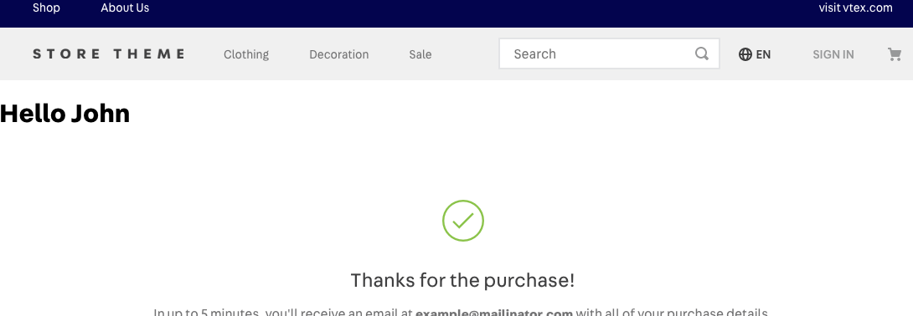

📢 Use this project, [contribute](https://github.com/vtex-apps/order-placed) to it or open issues to help evolve it using [Store Discussion](https://github.com/vtex-apps/store-discussion).

# Order Placed

## Configuration

**TODO**

## Customization

In order to apply CSS customizations in this and other blocks, follow the instructions given in the recipe on [Using CSS Handles for store customization](https://vtex.io/docs/recipes/style/using-css-handles-for-store-customization).

| CSS Handles                   |
| ----------------------------- |
| `attachmentContent`           |
| `attachmentHeader`            |
| `attachmentTitle`             |
| `attachmentToggleButton`      |
| `attachmentToggleLabel`       |
| `attachmentToggleWrapper`     |
| `attachmentWrapper`           |
| `bankInvoiceEmbed`            |
| `bankInvoiceEmbedBackground`  |
| `bankInvoiceEmbedWrapper`     |
| `barCodeCopyBtnWrapper`       |
| `barCodeNumber`               |
| `barCodeWrapper`              |
| `errorWrapper`                |
| `errorMessageContainer`       |
| `noticesList`                 |
| `noticesListItem`             |
| `orderDatetime`               |
| `orderNumber`                 |
| `orderOptionsWrapper`         |
| `orderPaymentItem`            |
| `orderPaymentWrapper`         |
| `orderSection`                |
| `orderSection--deliveryItems` |
| `orderSection--notices`       |
| `orderSection--pickupItems`   |
| `orderSeller`                 |
| `orderSoldBy`                 |
| `parcel`                      |
| `parcel--delivery`            |
| `parcel--pickup`              |
| `parcelAdditionalInfo`        |
| `parcelAddressWrapper`        |
| `parcelGiftDescription`       |
| `parcelHeader`                |
| `parcelHeader--delivery`      |
| `parcelHeader--pickup`        |
| `parcelHeaderColumn`          |
| `parcelInfoWrapper`           |
| `parcelReceiver`              |
| `parcelShippingEstimate`      |
| `parcelSLA`                   |
| `productImageColumn`          |
| `productImageWrapper`         |
| `productInfoColumn`           |
| `productLink`                 |
| `productListItem`             |
| `productListWrapper`          |
| `productMeasurementUnit`      |
| `productPriceColumn`          |
| `productQuantity`             |
| `productWrapper`              |
| `summaryAddress`              |
| `summaryBox`                  |
| `summaryBoxDelivery`          |
| `summaryBoxPickup`            |
| `summaryContent`              |
| `summaryItems`                |
| `summarySection`              |
| `summaryShipping`             |
| `summaryTitle`                |
| `totalList`                   |
| `totalListItem`               |
| `totalListItemName`           |
| `totalListItemValue`          |
| `totalListWrapper`            |

## Adding extensions

It is possible to add a component at the top of the page.

You can check how following the [example app](./order-placed-extension-example/). This component receives a prop called `orderGroup` with the order data.

## Contributing

Check it out [how to contribute](https://github.com/vtex-apps/awesome-io#contributing) with this project.
